# Model summary

This graph shows tensor data flow for the supplied input and executed path only.

```mermaid
%%{init: {"theme": "base", "htmlLabels": false, "flowchart": {"htmlLabels": false, "padding": 24, "rankSpacing": 70, "subGraphTitleMargin": {"top": 12, "bottom": 24}}, "themeVariables": {"fontFamily": "Arial", "fontSize": "14px", "lineColor": "#000000", "textColor": "#000000", "primaryTextColor": "#000000", "titleColor": "#000000", "edgeLabelBackground": "#ffffff"}, "themeCSS": ".flowchart-link {stroke:#000000!important;stroke-width:2.5px!important;}marker path {fill:#000000!important;stroke:#000000!important;}.cluster-label text,.cluster-label span,.cluster-label tspan {fill:#000000!important;color:#000000!important;font-weight:700!important;}.edgeLabel text {fill:#000000!important;}"}}%%
flowchart TD
    subgraph g0["ResNet (ResNet)"]
    direction TB
    n0{{"Input 1"}}:::input
    n1[["conv1 (Conv2d)<br/>Param #: 9,408<br/>Mult-Adds: 118,013,952"]]:::convolution
    n2[/"bn1 (BatchNorm2d)<br/>Param #: 128<br/>Mult-Adds: 128"/]:::normalization
    n3("relu (ReLU)<br/>Param #: --<br/>Mult-Adds: --"):::activation
    n4[/"maxpool (MaxPool2d)<br/>Param #: --<br/>Mult-Adds: --"\]:::max_pool
    subgraph g1["layer1 (Sequential)"]
    direction TB
    subgraph g2["0 (BasicBlock)"]
    direction TB
    n5[["conv1 (Conv2d)<br/>Param #: 36,864<br/>Mult-Adds: 115,605,504"]]:::convolution
    n6[/"bn1 (BatchNorm2d)<br/>Param #: 128<br/>Mult-Adds: 128"/]:::normalization
    n7("relu (ReLU)<br/>Param #: --<br/>Mult-Adds: --"):::activation
    n8[["conv2 (Conv2d)<br/>Param #: 36,864<br/>Mult-Adds: 115,605,504"]]:::convolution
    n9[/"bn2 (BatchNorm2d)<br/>Param #: 128<br/>Mult-Adds: 128"/]:::normalization
    n10("aten.add_.Tensor"):::operation
    n11("relu (ReLU)<br/>Param #: --<br/>Mult-Adds: --"):::activation
    end
    subgraph g3["1 (BasicBlock)"]
    direction TB
    n12[["conv1 (Conv2d)<br/>Param #: 36,864<br/>Mult-Adds: 115,605,504"]]:::convolution
    n13[/"bn1 (BatchNorm2d)<br/>Param #: 128<br/>Mult-Adds: 128"/]:::normalization
    n14("relu (ReLU)<br/>Param #: --<br/>Mult-Adds: --"):::activation
    n15[["conv2 (Conv2d)<br/>Param #: 36,864<br/>Mult-Adds: 115,605,504"]]:::convolution
    n16[/"bn2 (BatchNorm2d)<br/>Param #: 128<br/>Mult-Adds: 128"/]:::normalization
    n17("aten.add_.Tensor"):::operation
    n18("relu (ReLU)<br/>Param #: --<br/>Mult-Adds: --"):::activation
    end
    end
    subgraph g4["layer2 (Sequential)"]
    direction TB
    subgraph g5["0 (BasicBlock)"]
    direction TB
    n19[["conv1 (Conv2d)<br/>Param #: 73,728<br/>Mult-Adds: 57,802,752"]]:::convolution
    n20[/"bn1 (BatchNorm2d)<br/>Param #: 256<br/>Mult-Adds: 256"/]:::normalization
    n21("relu (ReLU)<br/>Param #: --<br/>Mult-Adds: --"):::activation
    n22[["conv2 (Conv2d)<br/>Param #: 147,456<br/>Mult-Adds: 115,605,504"]]:::convolution
    n23[/"bn2 (BatchNorm2d)<br/>Param #: 256<br/>Mult-Adds: 256"/]:::normalization
    subgraph g6["downsample (Sequential)"]
    direction TB
    n24[["0 (Conv2d)<br/>Param #: 8,192<br/>Mult-Adds: 6,422,528"]]:::convolution
    n25[/"1 (BatchNorm2d)<br/>Param #: 256<br/>Mult-Adds: 256"/]:::normalization
    end
    n26("aten.add_.Tensor"):::operation
    n27("relu (ReLU)<br/>Param #: --<br/>Mult-Adds: --"):::activation
    end
    subgraph g7["1 (BasicBlock)"]
    direction TB
    n28[["conv1 (Conv2d)<br/>Param #: 147,456<br/>Mult-Adds: 115,605,504"]]:::convolution
    n29[/"bn1 (BatchNorm2d)<br/>Param #: 256<br/>Mult-Adds: 256"/]:::normalization
    n30("relu (ReLU)<br/>Param #: --<br/>Mult-Adds: --"):::activation
    n31[["conv2 (Conv2d)<br/>Param #: 147,456<br/>Mult-Adds: 115,605,504"]]:::convolution
    n32[/"bn2 (BatchNorm2d)<br/>Param #: 256<br/>Mult-Adds: 256"/]:::normalization
    n33("aten.add_.Tensor"):::operation
    n34("relu (ReLU)<br/>Param #: --<br/>Mult-Adds: --"):::activation
    end
    end
    subgraph g8["layer3 (Sequential)"]
    direction TB
    subgraph g9["0 (BasicBlock)"]
    direction TB
    n35[["conv1 (Conv2d)<br/>Param #: 294,912<br/>Mult-Adds: 57,802,752"]]:::convolution
    n36[/"bn1 (BatchNorm2d)<br/>Param #: 512<br/>Mult-Adds: 512"/]:::normalization
    n37("relu (ReLU)<br/>Param #: --<br/>Mult-Adds: --"):::activation
    n38[["conv2 (Conv2d)<br/>Param #: 589,824<br/>Mult-Adds: 115,605,504"]]:::convolution
    n39[/"bn2 (BatchNorm2d)<br/>Param #: 512<br/>Mult-Adds: 512"/]:::normalization
    subgraph g10["downsample (Sequential)"]
    direction TB
    n40[["0 (Conv2d)<br/>Param #: 32,768<br/>Mult-Adds: 6,422,528"]]:::convolution
    n41[/"1 (BatchNorm2d)<br/>Param #: 512<br/>Mult-Adds: 512"/]:::normalization
    end
    n42("aten.add_.Tensor"):::operation
    n43("relu (ReLU)<br/>Param #: --<br/>Mult-Adds: --"):::activation
    end
    subgraph g11["1 (BasicBlock)"]
    direction TB
    n44[["conv1 (Conv2d)<br/>Param #: 589,824<br/>Mult-Adds: 115,605,504"]]:::convolution
    n45[/"bn1 (BatchNorm2d)<br/>Param #: 512<br/>Mult-Adds: 512"/]:::normalization
    n46("relu (ReLU)<br/>Param #: --<br/>Mult-Adds: --"):::activation
    n47[["conv2 (Conv2d)<br/>Param #: 589,824<br/>Mult-Adds: 115,605,504"]]:::convolution
    n48[/"bn2 (BatchNorm2d)<br/>Param #: 512<br/>Mult-Adds: 512"/]:::normalization
    n49("aten.add_.Tensor"):::operation
    n50("relu (ReLU)<br/>Param #: --<br/>Mult-Adds: --"):::activation
    end
    end
    subgraph g12["layer4 (Sequential)"]
    direction TB
    subgraph g13["0 (BasicBlock)"]
    direction TB
    n51[["conv1 (Conv2d)<br/>Param #: 1,179,648<br/>Mult-Adds: 57,802,752"]]:::convolution
    n52[/"bn1 (BatchNorm2d)<br/>Param #: 1,024<br/>Mult-Adds: 1,024"/]:::normalization
    n53("relu (ReLU)<br/>Param #: --<br/>Mult-Adds: --"):::activation
    n54[["conv2 (Conv2d)<br/>Param #: 2,359,296<br/>Mult-Adds: 115,605,504"]]:::convolution
    n55[/"bn2 (BatchNorm2d)<br/>Param #: 1,024<br/>Mult-Adds: 1,024"/]:::normalization
    subgraph g14["downsample (Sequential)"]
    direction TB
    n56[["0 (Conv2d)<br/>Param #: 131,072<br/>Mult-Adds: 6,422,528"]]:::convolution
    n57[/"1 (BatchNorm2d)<br/>Param #: 1,024<br/>Mult-Adds: 1,024"/]:::normalization
    end
    n58("aten.add_.Tensor"):::operation
    n59("relu (ReLU)<br/>Param #: --<br/>Mult-Adds: --"):::activation
    end
    subgraph g15["1 (BasicBlock)"]
    direction TB
    n60[["conv1 (Conv2d)<br/>Param #: 2,359,296<br/>Mult-Adds: 115,605,504"]]:::convolution
    n61[/"bn1 (BatchNorm2d)<br/>Param #: 1,024<br/>Mult-Adds: 1,024"/]:::normalization
    n62("relu (ReLU)<br/>Param #: --<br/>Mult-Adds: --"):::activation
    n63[["conv2 (Conv2d)<br/>Param #: 2,359,296<br/>Mult-Adds: 115,605,504"]]:::convolution
    n64[/"bn2 (BatchNorm2d)<br/>Param #: 1,024<br/>Mult-Adds: 1,024"/]:::normalization
    n65("aten.add_.Tensor"):::operation
    n66("relu (ReLU)<br/>Param #: --<br/>Mult-Adds: --"):::activation
    end
    end
    n67[("avgpool (AdaptiveAvgPool2d)<br/>Param #: --<br/>Mult-Adds: --")]:::avg_pool
    n68("aten.view.default"):::operation
    n69["fc (Linear)<br/>Param #: 513,000<br/>Mult-Adds: 513,000"]:::linear
    n70(["Output 1"]):::output
    end
    n0 -->|"[1, 3, 224, 224]"| n1
    n1 -->|"[1, 64, 112, 112]"| n2
    n2 -->|"[1, 64, 112, 112]"| n3
    n3 -->|"[1, 64, 112, 112]"| n4
    n4 -->|"[1, 64, 56, 56]"| n5
    n5 -->|"[1, 64, 56, 56]"| n6
    n6 -->|"[1, 64, 56, 56]"| n7
    n7 -->|"[1, 64, 56, 56]"| n8
    n8 -->|"[1, 64, 56, 56]"| n9
    n4 -->|"[1, 64, 56, 56]"| n10
    n9 -->|"[1, 64, 56, 56]"| n10
    n10 -->|"[1, 64, 56, 56]"| n11
    n11 -->|"[1, 64, 56, 56]"| n12
    n12 -->|"[1, 64, 56, 56]"| n13
    n13 -->|"[1, 64, 56, 56]"| n14
    n14 -->|"[1, 64, 56, 56]"| n15
    n15 -->|"[1, 64, 56, 56]"| n16
    n11 -->|"[1, 64, 56, 56]"| n17
    n16 -->|"[1, 64, 56, 56]"| n17
    n17 -->|"[1, 64, 56, 56]"| n18
    n18 -->|"[1, 64, 56, 56]"| n19
    n19 -->|"[1, 128, 28, 28]"| n20
    n20 -->|"[1, 128, 28, 28]"| n21
    n21 -->|"[1, 128, 28, 28]"| n22
    n22 -->|"[1, 128, 28, 28]"| n23
    n18 -->|"[1, 64, 56, 56]"| n24
    n24 -->|"[1, 128, 28, 28]"| n25
    n23 -->|"[1, 128, 28, 28]"| n26
    n25 -->|"[1, 128, 28, 28]"| n26
    n26 -->|"[1, 128, 28, 28]"| n27
    n27 -->|"[1, 128, 28, 28]"| n28
    n28 -->|"[1, 128, 28, 28]"| n29
    n29 -->|"[1, 128, 28, 28]"| n30
    n30 -->|"[1, 128, 28, 28]"| n31
    n31 -->|"[1, 128, 28, 28]"| n32
    n27 -->|"[1, 128, 28, 28]"| n33
    n32 -->|"[1, 128, 28, 28]"| n33
    n33 -->|"[1, 128, 28, 28]"| n34
    n34 -->|"[1, 128, 28, 28]"| n35
    n35 -->|"[1, 256, 14, 14]"| n36
    n36 -->|"[1, 256, 14, 14]"| n37
    n37 -->|"[1, 256, 14, 14]"| n38
    n38 -->|"[1, 256, 14, 14]"| n39
    n34 -->|"[1, 128, 28, 28]"| n40
    n40 -->|"[1, 256, 14, 14]"| n41
    n39 -->|"[1, 256, 14, 14]"| n42
    n41 -->|"[1, 256, 14, 14]"| n42
    n42 -->|"[1, 256, 14, 14]"| n43
    n43 -->|"[1, 256, 14, 14]"| n44
    n44 -->|"[1, 256, 14, 14]"| n45
    n45 -->|"[1, 256, 14, 14]"| n46
    n46 -->|"[1, 256, 14, 14]"| n47
    n47 -->|"[1, 256, 14, 14]"| n48
    n43 -->|"[1, 256, 14, 14]"| n49
    n48 -->|"[1, 256, 14, 14]"| n49
    n49 -->|"[1, 256, 14, 14]"| n50
    n50 -->|"[1, 256, 14, 14]"| n51
    n51 -->|"[1, 512, 7, 7]"| n52
    n52 -->|"[1, 512, 7, 7]"| n53
    n53 -->|"[1, 512, 7, 7]"| n54
    n54 -->|"[1, 512, 7, 7]"| n55
    n50 -->|"[1, 256, 14, 14]"| n56
    n56 -->|"[1, 512, 7, 7]"| n57
    n55 -->|"[1, 512, 7, 7]"| n58
    n57 -->|"[1, 512, 7, 7]"| n58
    n58 -->|"[1, 512, 7, 7]"| n59
    n59 -->|"[1, 512, 7, 7]"| n60
    n60 -->|"[1, 512, 7, 7]"| n61
    n61 -->|"[1, 512, 7, 7]"| n62
    n62 -->|"[1, 512, 7, 7]"| n63
    n63 -->|"[1, 512, 7, 7]"| n64
    n59 -->|"[1, 512, 7, 7]"| n65
    n64 -->|"[1, 512, 7, 7]"| n65
    n65 -->|"[1, 512, 7, 7]"| n66
    n66 -->|"[1, 512, 7, 7]"| n67
    n67 -->|"[1, 512, 1, 1]"| n68
    n68 -->|"[1, 512]"| n69
    n69 -->|"[1, 1000]"| n70
    style g0 fill:#ffffff,stroke:#64748b,stroke-width:2px,color:#000000
    style g1 fill:none,stroke:#60a5fa,stroke-width:2px,color:#000000
    style g2 fill:none,stroke:#a78bfa,stroke-width:2px,color:#000000
    style g3 fill:none,stroke:#a78bfa,stroke-width:2px,color:#000000
    style g4 fill:none,stroke:#60a5fa,stroke-width:2px,color:#000000
    style g5 fill:none,stroke:#a78bfa,stroke-width:2px,color:#000000
    style g6 fill:none,stroke:#5eead4,stroke-width:2px,color:#000000
    style g7 fill:none,stroke:#a78bfa,stroke-width:2px,color:#000000
    style g8 fill:none,stroke:#60a5fa,stroke-width:2px,color:#000000
    style g9 fill:none,stroke:#a78bfa,stroke-width:2px,color:#000000
    style g10 fill:none,stroke:#5eead4,stroke-width:2px,color:#000000
    style g11 fill:none,stroke:#a78bfa,stroke-width:2px,color:#000000
    style g12 fill:none,stroke:#60a5fa,stroke-width:2px,color:#000000
    style g13 fill:none,stroke:#a78bfa,stroke-width:2px,color:#000000
    style g14 fill:none,stroke:#5eead4,stroke-width:2px,color:#000000
    style g15 fill:none,stroke:#a78bfa,stroke-width:2px,color:#000000
    linkStyle default stroke:#000000,stroke-width:2.5px,color:#000000
    classDef activation fill:#ffedd5,stroke:#c2410c,stroke-width:2px,color:#000000
    classDef avg_pool fill:#ccfbf1,stroke:#0f766e,stroke-width:2px,color:#000000
    classDef convolution fill:#dbeafe,stroke:#1e40af,stroke-width:2px,color:#000000
    classDef input fill:#dbeafe,stroke:#1d4ed8,stroke-width:2px,color:#000000
    classDef linear fill:#dcfce7,stroke:#166534,stroke-width:2px,color:#000000
    classDef max_pool fill:#cffafe,stroke:#0e7490,stroke-width:2px,color:#000000
    classDef normalization fill:#ede9fe,stroke:#6d28d9,stroke-width:2px,color:#000000
    classDef operation fill:#fef3c7,stroke:#92400e,stroke-width:2px,color:#000000
    classDef output fill:#dcfce7,stroke:#15803d,stroke-width:2px,color:#000000
```

Arrow labels show tensor shapes. Black arrows indicate data flow. Colored subgraph borders indicate nesting depth; headings identify the module name and type. Layer shapes and colors follow the bundled layer_styles.json registry.

### Layer style legend

| Layer family | Shape |
| --- | --- |
| Activation | rounded |
| Average pooling | cylinder |
| Convolution | subroutine |
| Input | hexagon |
| Linear | rectangle |
| Max pooling | trapezoid |
| Normalization | parallelogram |
| Functional operation | rounded |
| Output | stadium |

## Layer statistics

| Layer | Input Shape | Output Shape | Param # | Mult-Adds |
| --- | --- | --- | --- | --- |
| ResNet (ResNet) | [1, 3, 224, 224] | [1, 1000] | -- | -- |
| conv1 (Conv2d) | [1, 3, 224, 224] | [1, 64, 112, 112] | 9,408 | 118,013,952 |
| bn1 (BatchNorm2d) | [1, 64, 112, 112] | [1, 64, 112, 112] | 128 | 128 |
| relu (ReLU) | [1, 64, 112, 112] | [1, 64, 112, 112] | -- | -- |
| maxpool (MaxPool2d) | [1, 64, 112, 112] | [1, 64, 56, 56] | -- | -- |
| layer1 (Sequential) | [1, 64, 56, 56] | [1, 64, 56, 56] | -- | -- |
| layer1.0 (BasicBlock) | [1, 64, 56, 56] | [1, 64, 56, 56] | -- | -- |
| layer1.0.conv1 (Conv2d) | [1, 64, 56, 56] | [1, 64, 56, 56] | 36,864 | 115,605,504 |
| layer1.0.bn1 (BatchNorm2d) | [1, 64, 56, 56] | [1, 64, 56, 56] | 128 | 128 |
| layer1.0.relu (ReLU) | [1, 64, 56, 56] | [1, 64, 56, 56] | -- | -- |
| layer1.0.conv2 (Conv2d) | [1, 64, 56, 56] | [1, 64, 56, 56] | 36,864 | 115,605,504 |
| layer1.0.bn2 (BatchNorm2d) | [1, 64, 56, 56] | [1, 64, 56, 56] | 128 | 128 |
| layer1.0.relu (ReLU) | [1, 64, 56, 56] | [1, 64, 56, 56] | -- | -- |
| layer1.1 (BasicBlock) | [1, 64, 56, 56] | [1, 64, 56, 56] | -- | -- |
| layer1.1.conv1 (Conv2d) | [1, 64, 56, 56] | [1, 64, 56, 56] | 36,864 | 115,605,504 |
| layer1.1.bn1 (BatchNorm2d) | [1, 64, 56, 56] | [1, 64, 56, 56] | 128 | 128 |
| layer1.1.relu (ReLU) | [1, 64, 56, 56] | [1, 64, 56, 56] | -- | -- |
| layer1.1.conv2 (Conv2d) | [1, 64, 56, 56] | [1, 64, 56, 56] | 36,864 | 115,605,504 |
| layer1.1.bn2 (BatchNorm2d) | [1, 64, 56, 56] | [1, 64, 56, 56] | 128 | 128 |
| layer1.1.relu (ReLU) | [1, 64, 56, 56] | [1, 64, 56, 56] | -- | -- |
| layer2 (Sequential) | [1, 64, 56, 56] | [1, 128, 28, 28] | -- | -- |
| layer2.0 (BasicBlock) | [1, 64, 56, 56] | [1, 128, 28, 28] | -- | -- |
| layer2.0.conv1 (Conv2d) | [1, 64, 56, 56] | [1, 128, 28, 28] | 73,728 | 57,802,752 |
| layer2.0.bn1 (BatchNorm2d) | [1, 128, 28, 28] | [1, 128, 28, 28] | 256 | 256 |
| layer2.0.relu (ReLU) | [1, 128, 28, 28] | [1, 128, 28, 28] | -- | -- |
| layer2.0.conv2 (Conv2d) | [1, 128, 28, 28] | [1, 128, 28, 28] | 147,456 | 115,605,504 |
| layer2.0.bn2 (BatchNorm2d) | [1, 128, 28, 28] | [1, 128, 28, 28] | 256 | 256 |
| layer2.0.downsample (Sequential) | [1, 64, 56, 56] | [1, 128, 28, 28] | -- | -- |
| layer2.0.downsample.0 (Conv2d) | [1, 64, 56, 56] | [1, 128, 28, 28] | 8,192 | 6,422,528 |
| layer2.0.downsample.1 (BatchNorm2d) | [1, 128, 28, 28] | [1, 128, 28, 28] | 256 | 256 |
| layer2.0.relu (ReLU) | [1, 128, 28, 28] | [1, 128, 28, 28] | -- | -- |
| layer2.1 (BasicBlock) | [1, 128, 28, 28] | [1, 128, 28, 28] | -- | -- |
| layer2.1.conv1 (Conv2d) | [1, 128, 28, 28] | [1, 128, 28, 28] | 147,456 | 115,605,504 |
| layer2.1.bn1 (BatchNorm2d) | [1, 128, 28, 28] | [1, 128, 28, 28] | 256 | 256 |
| layer2.1.relu (ReLU) | [1, 128, 28, 28] | [1, 128, 28, 28] | -- | -- |
| layer2.1.conv2 (Conv2d) | [1, 128, 28, 28] | [1, 128, 28, 28] | 147,456 | 115,605,504 |
| layer2.1.bn2 (BatchNorm2d) | [1, 128, 28, 28] | [1, 128, 28, 28] | 256 | 256 |
| layer2.1.relu (ReLU) | [1, 128, 28, 28] | [1, 128, 28, 28] | -- | -- |
| layer3 (Sequential) | [1, 128, 28, 28] | [1, 256, 14, 14] | -- | -- |
| layer3.0 (BasicBlock) | [1, 128, 28, 28] | [1, 256, 14, 14] | -- | -- |
| layer3.0.conv1 (Conv2d) | [1, 128, 28, 28] | [1, 256, 14, 14] | 294,912 | 57,802,752 |
| layer3.0.bn1 (BatchNorm2d) | [1, 256, 14, 14] | [1, 256, 14, 14] | 512 | 512 |
| layer3.0.relu (ReLU) | [1, 256, 14, 14] | [1, 256, 14, 14] | -- | -- |
| layer3.0.conv2 (Conv2d) | [1, 256, 14, 14] | [1, 256, 14, 14] | 589,824 | 115,605,504 |
| layer3.0.bn2 (BatchNorm2d) | [1, 256, 14, 14] | [1, 256, 14, 14] | 512 | 512 |
| layer3.0.downsample (Sequential) | [1, 128, 28, 28] | [1, 256, 14, 14] | -- | -- |
| layer3.0.downsample.0 (Conv2d) | [1, 128, 28, 28] | [1, 256, 14, 14] | 32,768 | 6,422,528 |
| layer3.0.downsample.1 (BatchNorm2d) | [1, 256, 14, 14] | [1, 256, 14, 14] | 512 | 512 |
| layer3.0.relu (ReLU) | [1, 256, 14, 14] | [1, 256, 14, 14] | -- | -- |
| layer3.1 (BasicBlock) | [1, 256, 14, 14] | [1, 256, 14, 14] | -- | -- |
| layer3.1.conv1 (Conv2d) | [1, 256, 14, 14] | [1, 256, 14, 14] | 589,824 | 115,605,504 |
| layer3.1.bn1 (BatchNorm2d) | [1, 256, 14, 14] | [1, 256, 14, 14] | 512 | 512 |
| layer3.1.relu (ReLU) | [1, 256, 14, 14] | [1, 256, 14, 14] | -- | -- |
| layer3.1.conv2 (Conv2d) | [1, 256, 14, 14] | [1, 256, 14, 14] | 589,824 | 115,605,504 |
| layer3.1.bn2 (BatchNorm2d) | [1, 256, 14, 14] | [1, 256, 14, 14] | 512 | 512 |
| layer3.1.relu (ReLU) | [1, 256, 14, 14] | [1, 256, 14, 14] | -- | -- |
| layer4 (Sequential) | [1, 256, 14, 14] | [1, 512, 7, 7] | -- | -- |
| layer4.0 (BasicBlock) | [1, 256, 14, 14] | [1, 512, 7, 7] | -- | -- |
| layer4.0.conv1 (Conv2d) | [1, 256, 14, 14] | [1, 512, 7, 7] | 1,179,648 | 57,802,752 |
| layer4.0.bn1 (BatchNorm2d) | [1, 512, 7, 7] | [1, 512, 7, 7] | 1,024 | 1,024 |
| layer4.0.relu (ReLU) | [1, 512, 7, 7] | [1, 512, 7, 7] | -- | -- |
| layer4.0.conv2 (Conv2d) | [1, 512, 7, 7] | [1, 512, 7, 7] | 2,359,296 | 115,605,504 |
| layer4.0.bn2 (BatchNorm2d) | [1, 512, 7, 7] | [1, 512, 7, 7] | 1,024 | 1,024 |
| layer4.0.downsample (Sequential) | [1, 256, 14, 14] | [1, 512, 7, 7] | -- | -- |
| layer4.0.downsample.0 (Conv2d) | [1, 256, 14, 14] | [1, 512, 7, 7] | 131,072 | 6,422,528 |
| layer4.0.downsample.1 (BatchNorm2d) | [1, 512, 7, 7] | [1, 512, 7, 7] | 1,024 | 1,024 |
| layer4.0.relu (ReLU) | [1, 512, 7, 7] | [1, 512, 7, 7] | -- | -- |
| layer4.1 (BasicBlock) | [1, 512, 7, 7] | [1, 512, 7, 7] | -- | -- |
| layer4.1.conv1 (Conv2d) | [1, 512, 7, 7] | [1, 512, 7, 7] | 2,359,296 | 115,605,504 |
| layer4.1.bn1 (BatchNorm2d) | [1, 512, 7, 7] | [1, 512, 7, 7] | 1,024 | 1,024 |
| layer4.1.relu (ReLU) | [1, 512, 7, 7] | [1, 512, 7, 7] | -- | -- |
| layer4.1.conv2 (Conv2d) | [1, 512, 7, 7] | [1, 512, 7, 7] | 2,359,296 | 115,605,504 |
| layer4.1.bn2 (BatchNorm2d) | [1, 512, 7, 7] | [1, 512, 7, 7] | 1,024 | 1,024 |
| layer4.1.relu (ReLU) | [1, 512, 7, 7] | [1, 512, 7, 7] | -- | -- |
| avgpool (AdaptiveAvgPool2d) | [1, 512, 7, 7] | [1, 512, 1, 1] | -- | -- |
| fc (Linear) | [1, 512] | [1, 1000] | 513,000 | 513,000 |

Functional-operation MACs: — (not estimated). Totals retain torchinfo's existing module-based MAC coverage.

## Totals

| Metric | Value |
| --- | --- |
| Total params | 11,689,512 |
| Trainable params | 11,689,512 |
| Non-trainable params | 0 |
| Total mult-adds (G) | 1.81 |
| Input size (kB) | 602.18 |
| Forward/backward pass size (MB) | 39.75 |
| Params size (MB) | 46.76 |
| Estimated Total Size (MB) | 87.11 |
